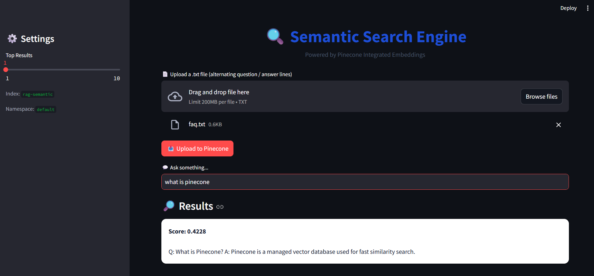

# 🔍 Semantic Search Engine

[](https://github.com/Gayathri-Reddy874/semantic-search-engine-pinecone/actions/workflows/ci.yml)
[](LICENSE)
[](https://www.python.org/)
[](https://streamlit.io/)
[](https://www.pinecone.io/)
[](tests)

A production-grade semantic search application built with **Streamlit** and
**Pinecone's integrated inference API**. Upload a Q&A text file, embed it with
zero manual embedding calls, and query it in natural language.

## Architecture

The app is split into a thin UI layer and a testable core, so business logic
never depends on Streamlit:

```
semantic-search-engine-pinecone/
├── app.py                   # Streamlit UI - rendering only
├── src/
│   ├── config.py            # Typed, validated settings (env-driven)
│   ├── document_loader.py   # Parses raw text into Document objects
│   ├── pinecone_client.py   # Pinecone SDK wrapper: connect, upsert, search, retries
│   ├── search_service.py    # Orchestrates loader + client for the UI
│   ├── exceptions.py        # App-specific exception hierarchy
│   └── logger.py            # Structured logging
├── tests/                   # Unit tests (mocked Pinecone — no network/API key needed)
├── sample_data/
│   └── faq.txt              # Sample Q&A file for trying the app immediately
├── screenshots/             # README images
├── Dockerfile
├── pyproject.toml           # Project metadata + ruff/pytest config
├── requirements.txt         # Production dependencies
├── requirements-dev.txt     # + pytest, ruff (dev/CI only)
└── LICENSE
```

**Why this structure:** each layer can be tested and swapped independently.
`document_loader.py` doesn't know Pinecone exists; `pinecone_client.py`
doesn't know Streamlit exists. `search_service.py` is the only module the UI
talks to.

## Screenshots

**Search in action** - upload a Q&A file, embed it via Pinecone's integrated inference, then query it in plain English:



> Add more screenshots to `screenshots/` (e.g. the upload flow, index stats after upload) and reference them here the same way.

## Features

- **Integrated embeddings** - Pinecone embeds text server-side (`multilingual-e5-large`); no separate embedding API calls to manage.
- **Config validation at startup** - missing/placeholder API keys fail fast with a clear error, not a cryptic SDK traceback mid-request.
- **Retry with backoff** - transient network errors on upsert/search are retried automatically (`tenacity`).
- **Batched uploads** - large files are chunked to stay under Pinecone's per-request limits.
- **Typed exceptions** - `DocumentParsingError`, `VectorStoreUpsertError`, etc., so the UI can show specific, actionable messages instead of generic failures.
- **20 unit tests, 88% coverage** — Pinecone calls are mocked, so the suite runs offline in CI.

## Getting Started

### 1. Install

```bash
python -m venv .venv && source .venv/bin/activate
pip install -r requirements.txt
```

### 2. Configure

```bash
cp .env.example .env
# then edit .env and set PINECONE_API_KEY
```

### 3. Run

```bash
streamlit run app.py
```

### 4. Try it

Upload `sample_data/faq.txt` (alternating question/answer lines), click
**Upload to Pinecone**, then ask a question like *"what is a vector
embedding?"*

## Running Tests

```bash
pip install -r requirements-dev.txt
pytest --cov=src --cov-report=term-missing
ruff check .
```

## Docker

```bash
docker build -t semantic-search-engine .
docker run -p 8501:8501 --env-file .env semantic-search-engine
```

## Input File Format

Plain `.txt` file, alternating lines of question then answer:

```
What is Pinecone?
Pinecone is a managed vector database used for fast similarity search.
What is semantic search?
Semantic search retrieves results based on meaning rather than exact keyword matches.
```

## Configuration Reference

| Variable | Default | Description |
|---|---|---|
| `PINECONE_API_KEY` | — (required) | Pinecone API key |
| `PINECONE_INDEX_NAME` | `rag-semantic` | Index to create/use |
| `PINECONE_NAMESPACE` | `default` | Namespace within the index |
| `EMBEDDING_MODEL` | `multilingual-e5-large` | Pinecone integrated embedding model |
| `MAX_UPLOAD_SIZE_MB` | `5` | Upload size limit enforced in the UI |
| `DEFAULT_TOP_K` / `MAX_TOP_K` | `3` / `10` | Search result count bounds |
| `LOG_LEVEL` | `INFO` | Python logging level |

## Possible Extensions

- Swap `.txt` upload for PDF/CSV ingestion
- Add authentication before exposing the upload endpoint publicly
- Add a `/health` endpoint for container orchestration probes beyond the Docker healthcheck
- Support delete/re-index operations from the UI

## Author

**Gayathri (Mallareddygari Gayathri)**
AI/ML Engineer
GitHub: [@Gayathri-Reddy874](https://github.com/Gayathri-Reddy874)

## License

This project is licensed under the [MIT License](LICENSE).
